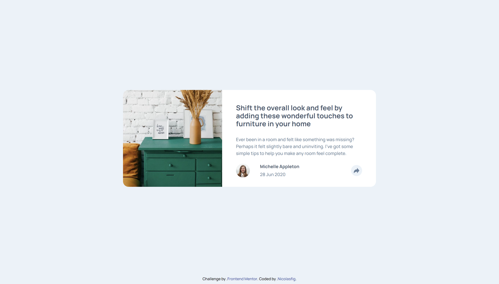
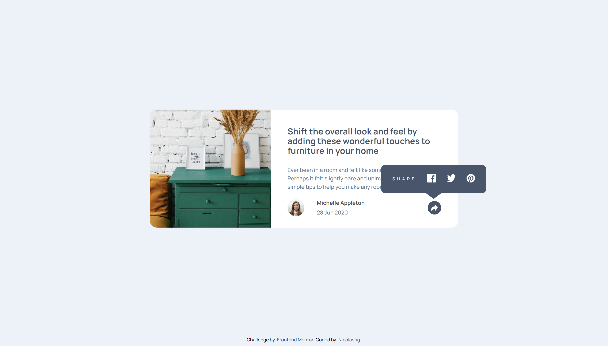
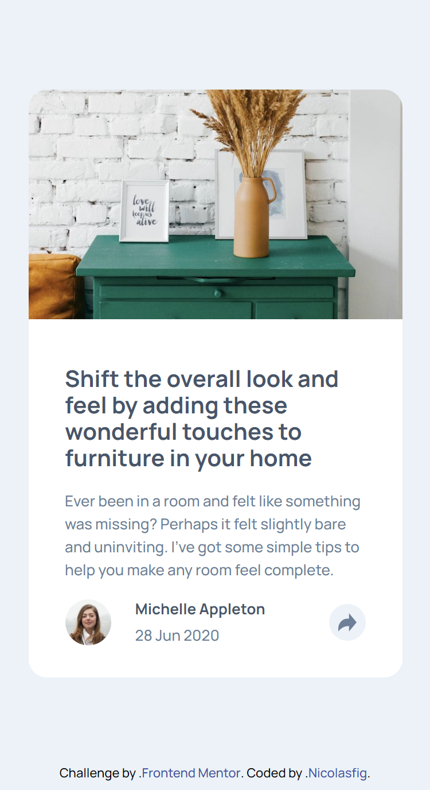
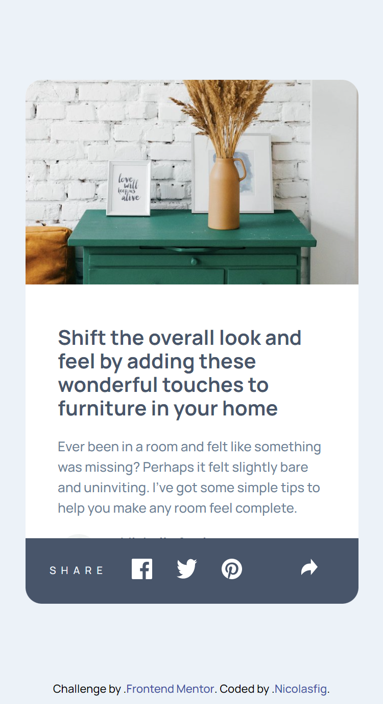

# Frontend Mentor - Article preview component solution

This is a solution to the [Article preview component challenge on Frontend Mentor](https://www.frontendmentor.io/challenges/article-preview-component-dYBN_pYFT). Frontend Mentor challenges help you improve your coding skills by building realistic projects.

## Table of contents

- [Overview](#overview)
  - [The challenge](#the-challenge)
  - [Screenshot](#screenshot)
  - [Links](#links)
- [My process](#my-process)
  - [Built with](#built-with)
  - [What I learned](#what-i-learned)
  - [Continued development](#continued-development)
  - [Useful resources](#useful-resources)
- [Author](#author)
- [Acknowledgments](#acknowledgments)

**Note: Delete this note and update the table of contents based on what sections you keep.**

## Overview

### The challenge

Your challenge is to build out this article preview component and get it looking as close to the design as possible.

You can use any tools you like to help you complete the challenge. So if you've got something you'd like to practice, feel free to give it a go.

The only JavaScript you'll need for this challenge is to initiate the share options when someone clicks the share icon.

Your users should be able to:

- View the optimal layout for the component depending on their device's screen size
- See the social media share links when they click the share icon

### Screenshots






### Links

- Solution URL: [Code](https://github.com/nicolasfig/article-preview-component)
- Live Site URL: [Live site](https://nicolasfig.github.io/article-preview-component)

## My process

### Built with

- Semantic HTML5 markup
- CSS custom properties
- Flexbox
- Javascript

### What I learned

A bit of css positioning using absolute and relative values

The code I used for creating and positioning the social icon container

```css
.share-buttons {
  display: none;
  align-items: center;
  justify-content: space-evenly;
  flex-direction: row;
  width: 248px;
  height: 66px;
  border-radius: var(--s-8);
  background-color: var(--very-dark-grayish-blue);
  position: absolute;
  left: -110px;
  top: -85px;
}

.share-buttons::after {
  content: "";
  position: absolute;
  display: block;
  width: 0;
  z-index: 1;
  border-style: solid;
  border-color: var(--very-dark-grayish-blue) transparent;
  border-width: 15px 20px 0;
  bottom: -14px;
  left: 50%;
  margin-left: -20px;
}
```

### Continued development

I need to learn how to use positioning more effectively

### Useful resources

- [This](https://www.html-code-generator.com/css/speech-bubble-generator) To generate the shape of the social icons container
- [Flexbox Malven](https://flexbox.malven.co/)
- [MDN docs](https://developer.mozilla.org/en-US/)

## Author

- Frontend Mentor - [@nicolasfig](https://www.frontendmentor.io/profile/nicolasfig)
- Github - [@nicolasfig](https://github.com/nicolasfig/)
